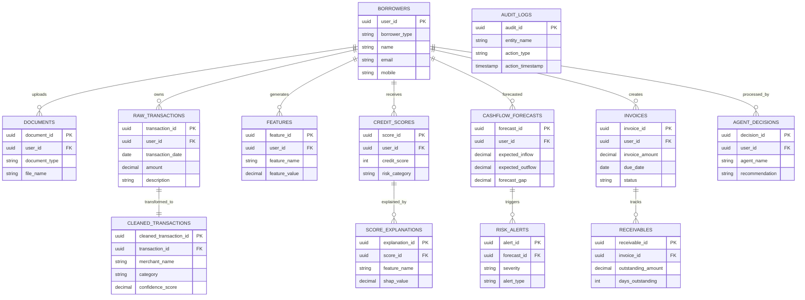

# CashFlow Copilot Database

```mermaid
erDiagram

    BORROWERS {
        uuid user_id PK
        string borrower_type
        string name
        string email
        string mobile
    }

    DOCUMENTS {
        uuid document_id PK
        uuid user_id FK
        string document_type
        string file_name
    }

    RAW_TRANSACTIONS {
        uuid transaction_id PK
        uuid user_id FK
        date transaction_date
        decimal amount
        string description
    }

    CLEANED_TRANSACTIONS {
        uuid cleaned_transaction_id PK
        uuid transaction_id FK
        string merchant_name
        string category
        decimal confidence_score
    }

    FEATURES {
        uuid feature_id PK
        uuid user_id FK
        string feature_name
        decimal feature_value
    }

    CREDIT_SCORES {
        uuid score_id PK
        uuid user_id FK
        int credit_score
        string risk_category
    }

    SCORE_EXPLANATIONS {
        uuid explanation_id PK
        uuid score_id FK
        string feature_name
        decimal shap_value
    }

    CASHFLOW_FORECASTS {
        uuid forecast_id PK
        uuid user_id FK
        decimal expected_inflow
        decimal expected_outflow
        decimal forecast_gap
    }

    RISK_ALERTS {
        uuid alert_id PK
        uuid forecast_id FK
        string severity
        string alert_type
    }

    INVOICES {
        uuid invoice_id PK
        uuid user_id FK
        decimal invoice_amount
        date due_date
        string status
    }

    RECEIVABLES {
        uuid receivable_id PK
        uuid invoice_id FK
        decimal outstanding_amount
        int days_outstanding
    }

    AGENT_DECISIONS {
        uuid decision_id PK
        uuid user_id FK
        string agent_name
        string recommendation
    }

    AUDIT_LOGS {
        uuid audit_id PK
        string entity_name
        string action_type
        timestamp action_timestamp
    }

    BORROWERS ||--o{ DOCUMENTS : uploads
    BORROWERS ||--o{ RAW_TRANSACTIONS : owns

    RAW_TRANSACTIONS ||--|| CLEANED_TRANSACTIONS : transformed_to

    BORROWERS ||--o{ FEATURES : generates

    BORROWERS ||--o{ CREDIT_SCORES : receives
    CREDIT_SCORES ||--o{ SCORE_EXPLANATIONS : explained_by

    BORROWERS ||--o{ CASHFLOW_FORECASTS : forecasted
    CASHFLOW_FORECASTS ||--o{ RISK_ALERTS : triggers

    BORROWERS ||--o{ INVOICES : creates
    INVOICES ||--o{ RECEIVABLES : tracks

    BORROWERS ||--o{ AGENT_DECISIONS : processed_by
```